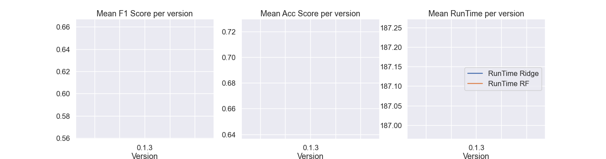

# Benchmark results from current and previous versions

The markdown tables included in this folder can be used to trace the performance of CST between version, on 
datasets where CST performed the worse compared to Mini Rocket.

Bellow are plots summurazing the mean performances metrics between versions. Version 0.1.3 was the version used to produce the paper results.

